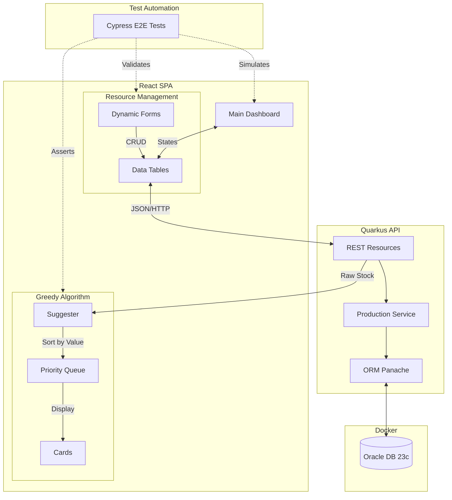
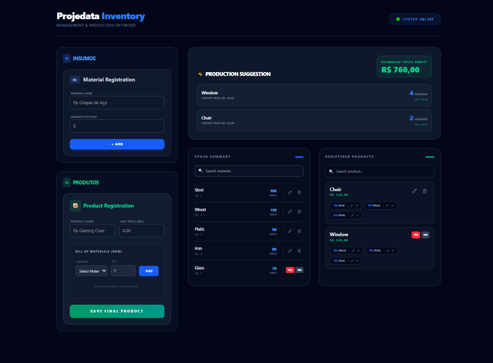
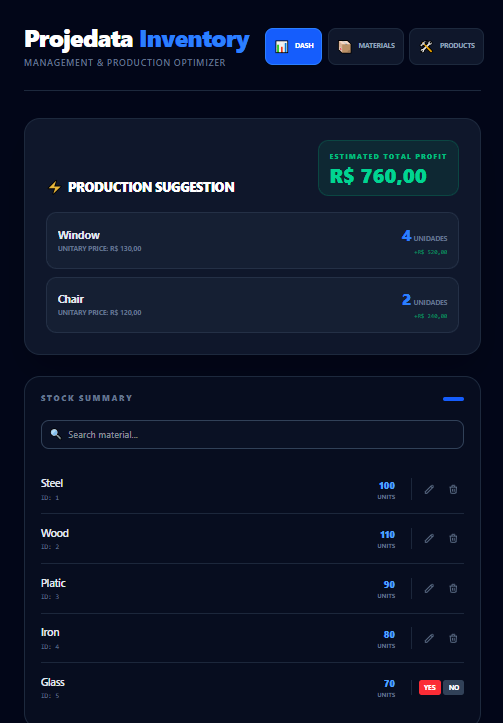
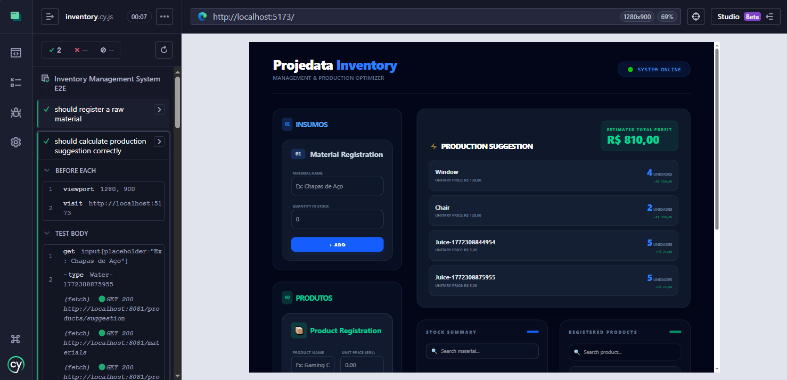
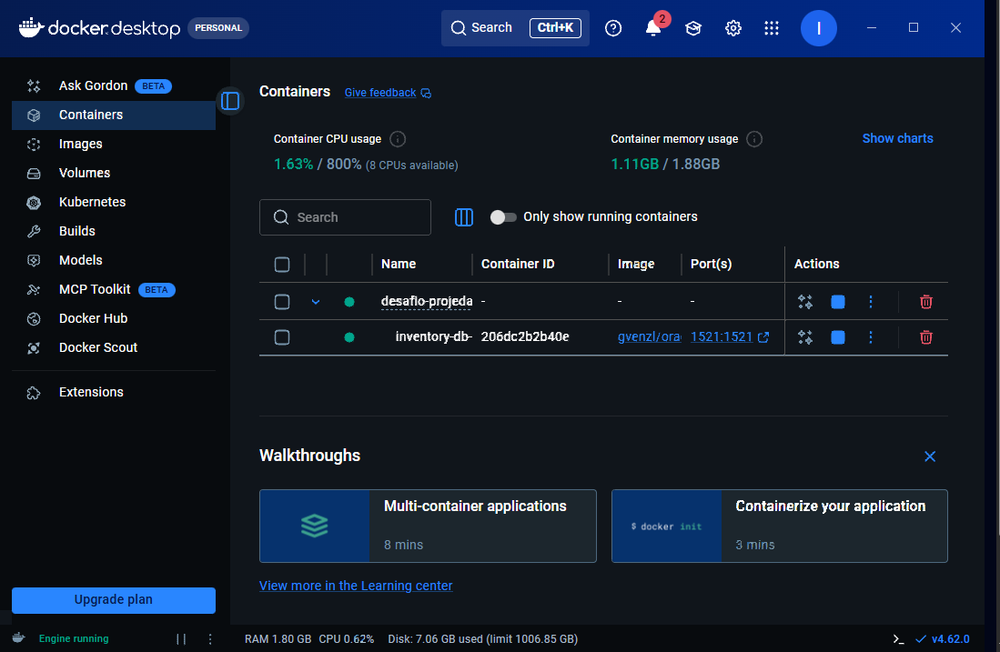

# 📦 Inventory & Production Management System

### Choose your language / Escolha seu idioma:

* [🇺🇸 English Version](#english-version)
* [🇧🇷 Versão em Português](#versão-em-português)

---
#### interact with a mock of project/ interaja com o simulador do projeto
➡ [Simulator / Simulador](https://githubpages....)

### 🔄 System Interaction Flow (Fluxo de Interação)


---

## English Version

### Table of Contents

1. [Tech Stack](#tech-stack)
2. [Quick Start](#quick-start)
3. [Functional Requirements (RF)](#functional-requirements-rf)
4. [Non-Functional Requirements (RNF)](#non-functional-requirements-rnf)
5. [Automated Testing](#automated-testing)
6. [Architecture Decisions](#architecture-decisions)
7. [A Brief Preview](#a-brief-preview--uma-breve-visualização)

### Tech Stack

* **Backend:** Quarkus (Java 17+)
* **Frontend:** React (Vite), Tailwind CSS
* **Database:** Oracle Database 23c Free (thin)
* **Testing:** Cypress (E2E)

### Quick Start

To run the project with Live Reload enabled:

#### 1. Database (Docker)

```bash
docker-compose up -d

```

*Wait for the log: `DATABASE IS READY TO USE!*`

#### 2. Backend (Quarkus)

```bash
./mvnw clean quarkus:dev

```

#### 3. Frontend (Vite)

```bash
npm install
npm run dev

```

### Functional Requirements (RF)

* **RF001:** Backend CRUD for Product management.
* **RF002:** Backend CRUD for Raw Material management.
* **RF003:** Backend CRUD to associate raw materials to products (BOM).
* **RF004:** Backend logic to query products that can be produced based on current stock.
* **RF005:** Frontend interface for Product CRUD.
* **RF006:** Frontend interface for Raw Material CRUD.
* **RF007:** Integrated UI for associating materials to products (within Product registry).
* **RF008:** Dashboard UI to list suggested production quantities and total estimated value.

### Non-Functional Requirements (RNF)

* **RNF001:** Web platform compatibility (Chrome, Firefox, Edge).
* **RNF002:** API-based architecture (Separated Front-end and Back-end).
* **RNF003:** Fully Responsive UI.
* **RNF004:** Data persistence using Oracle Database.
* **RNF005:** Backend developed with Quarkus Framework.
* **RNF006:** Frontend developed with React.
* **RNF007:** English standards for code, database schemas, and documentation.

### Automated Testing

* **Unit Tests:** JUnit 5 for backend business logic.
* **E2E Integration:** Cypress covering the full flow (Material -> Product -> Suggestion).

```bash
# Run Cypress
npx cypress run

```

### Architecture Decisions

* **Greedy Algorithm:** The production suggestion prioritizes highest-value products first. In case of a price tie, it prioritizes the most resource-efficient product.
* **Oracle Free Slim:** Used to minimize environment footprint while ensuring enterprise-grade compliance.

---

#### ⏫ [Back to Top / Voltar ao Topo](#choose-your-language--escolha-seu-idioma)

## Versão em Português

### Sumário

1. [Stacks Utilizadas](#stacks-utilizadas)
2. [Início Rápido](#início-rápido)
3. [Requisitos Funcionais (RF)](#requisitos-funcionais-rf)
4. [Requisitos Não Funcionais (RNF)](#requisitos-não-funcionais-rnf)
5. [Testes Automatizados](#testes-automatizados)
6. [Decisões de Arquitetura](#decisões-de-arquitetura)
7. [Uma Breve Visualização](#a-brief-preview--uma-breve-visualização)

### Stacks Utilizadas

* **Back-end:** Quarkus (Java 17+)
* **Front-end:** React (Vite), Tailwind CSS
* **Banco de Dados:** Oracle Database 23c Free (thin)
* **Testes:** Cypress (E2E)

### Início Rápido

Para rodar o projeto com Live Reload habilitado:

#### 1. Banco de Dados (Docker)

```bash
docker-compose up -d

```

*Aguarde o log: `DATABASE IS READY TO USE!*`

#### 2. Back-end (Quarkus)

```bash
./mvnw clean quarkus:dev

```

#### 3. Front-end (Vite)

```bash
npm install
npm run dev

```

### Requisitos Funcionais (RF)

* **RF001:** Desenvolver no back-end o CRUD para cadastro de produtos.
* **RF002:** Desenvolver no back-end o CRUD para cadastro de matérias-primas.
* **RF003:** Desenvolver no back-end o CRUD para associar matérias-primas aos produtos.
* **RF004:** Consulta de produtos que podem ser produzidos com base no estoque disponível.
* **RF005:** Interface gráfica no front-end para operações CRUD de produtos.
* **RF006:** Interface gráfica no front-end para operações CRUD de matérias-primas.
* **RF007:** Interface integrada para associar materiais aos produtos (BOM).
* **RF008:** Listagem de sugestão de produção (quantidades) e valor total obtido.

### Requisitos Não Funcionais (RNF)

* **RNF001:** Plataforma WEB executável em Chrome, Firefox e Edge.
* **RNF002:** Arquitetura baseada em API (Separação back-end e front-end).
* **RNF003:** Interface Responsiva.
* **RNF004:** Persistência de dados em Oracle Database.
* **RNF005:** Back-end utilizando framework Quarkus.
* **RNF006:** Front-end utilizando React.
* **RNF007:** Codificação, tabelas e documentação em língua inglesa.

### Testes Automatizados

* **Testes Unitários:** JUnit 5 para lógica de negócio no back-end.
* **Integração E2E:** Cypress cobrindo o fluxo completo (Material -> Produto -> Sugestão).

```bash
# Executar Cypress
npx cypress run

```

### Decisões de Arquitetura

* **Algoritmo Guloso (Greedy):** A sugestão de produção prioriza produtos de maior valor. Em caso de empate no preço, prioriza o produto que consome menos recursos totais.
* **Oracle Free Slim:** Utilizado para reduzir o consumo de recursos do ambiente de desenvolvimento mantendo a compatibilidade industrial.

---
### A brief preview / Uma breve visualização

#### desktop version / versao desktop
"
#### mobile version / versao para dispositivos móveis
"
#### Cypress test view / visualização de testes com Cypress
"
#### Cypress test view / visualização de testes com Cypress
"


---

⏫ [Voltar ao Topo](#choose-your-language--escolha-seu-idioma)

---
